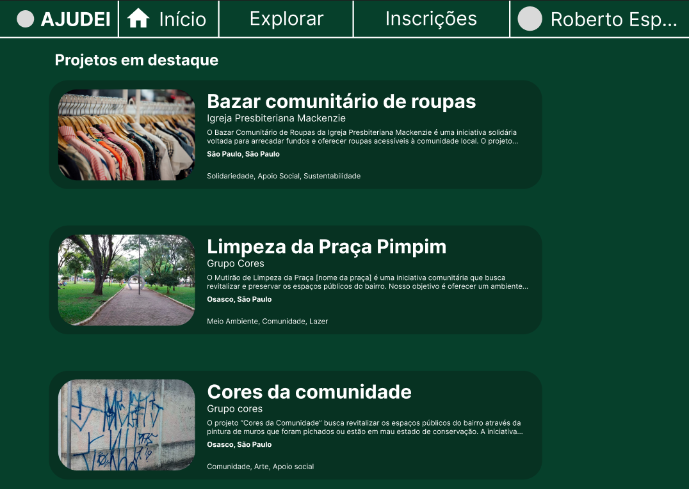
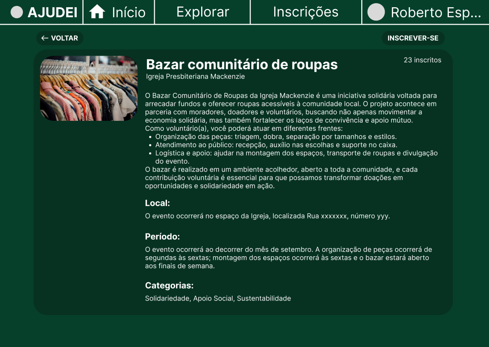
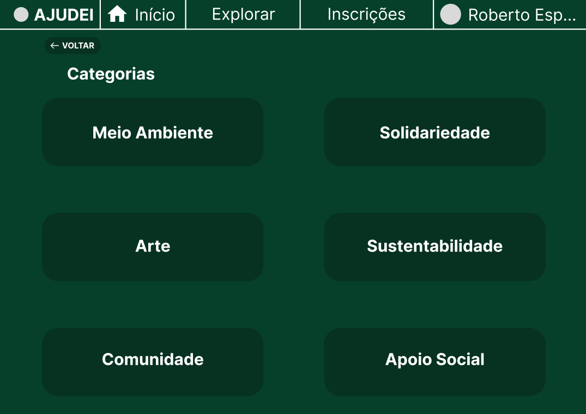
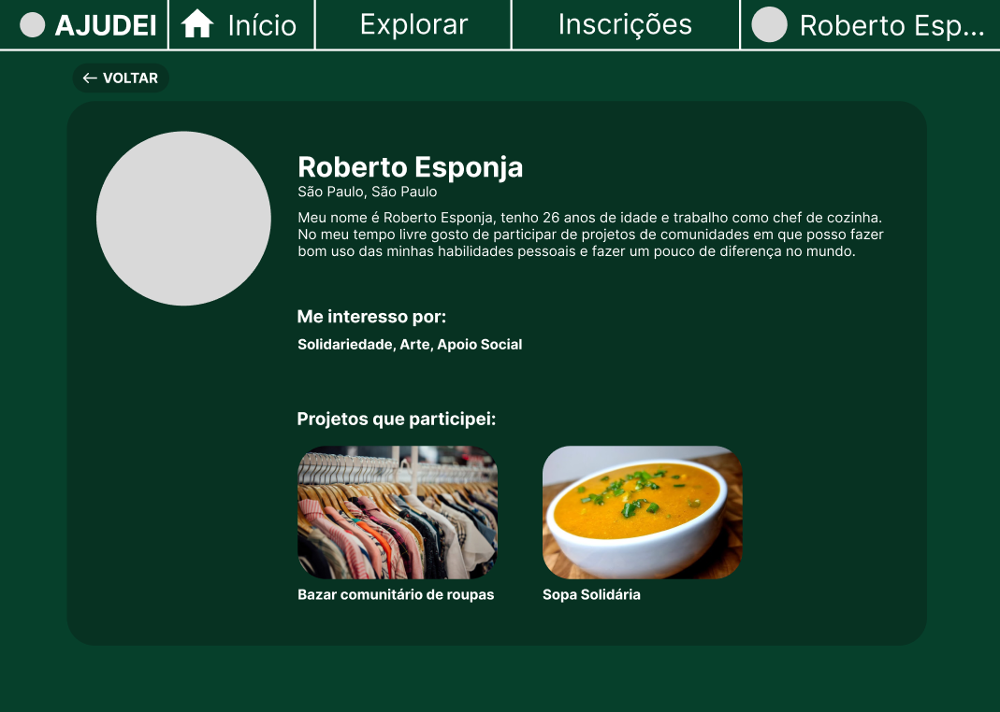
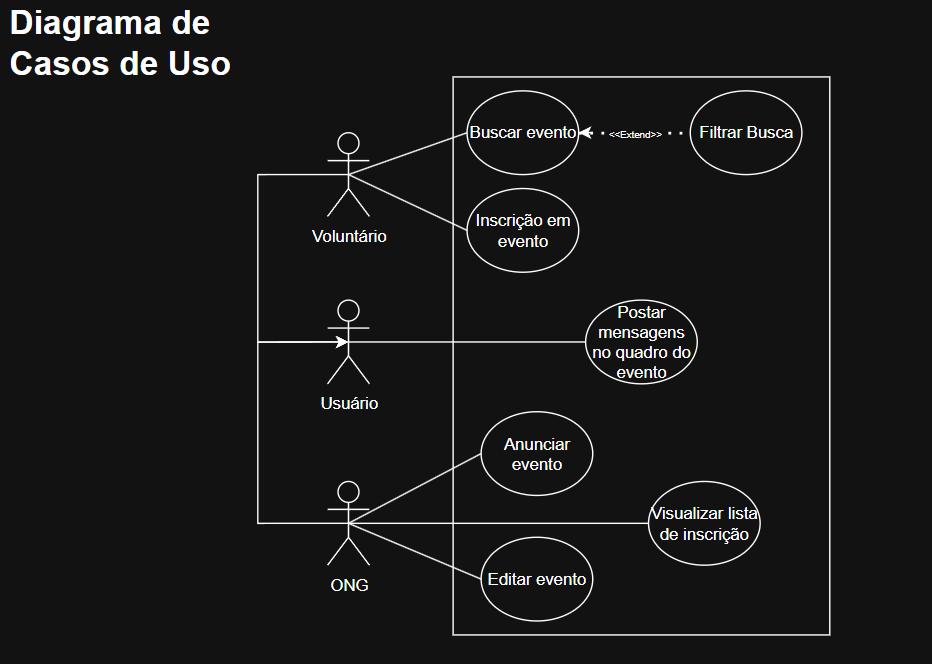

<h1 style=border-bottom:none;margin-bottom:0px> AJUDEI </h1>
Projeto de Laboratorio de Engenharia de Software

#

## 1. Introdução - Descrição breve do projeto

 O presente trabalho tem como objetivo propor o desenvolvimento de uma plataforma digital de trabalho comunitário, destinada a conectar instituições sociais, como organizações não governamentais (ONGs), a pessoas interessadas em atuar como voluntárias.

A motivação para a criação da plataforma decorre da necessidade de proporcionar maior visibilidade às ações promovidas por instituições sociais e, ao mesmo tempo, facilitar o acesso de indivíduos que desejam colaborar em atividades de caráter comunitário. Dessa forma, busca-se criar um ambiente que centralize oportunidades de voluntariado, promovendo a interação entre organizações que precisam de apoio e pessoas dispostas a contribuir com a sociedade por meio do trabalho voluntário.

A plataforma será desenvolvida no formato de um website responsivo, no qual instituições previamente verificadas poderão divulgar projetos e atividades sociais, especificando informações como datas, locais e disponibilidade de vagas. Em contrapartida, usuários cadastrados poderão pesquisar e filtrar atividades em regiões de interesse, inscrever-se para participar e manter um histórico de sua atuação voluntária. 

## 2. Definição da demanda
### 2.1 Problema ou oportunidade percebida

No contexto atual, observa-se uma dificuldade significativa para que instituições sociais encontrem voluntários de forma eficiente. Muitas vezes, a divulgação de atividades ocorre de maneira descentralizada, dificultando o alcance de interessados. Ao mesmo tempo, indivíduos dispostos a atuar como voluntários enfrentam obstáculos para identificar oportunidades confiáveis e acessíveis em sua região.

### 2.2 Razão ou justificativa para a demanda

Nesse cenário, a criação de uma plataforma digital especializada representa uma oportunidade de otimizar a interação entre instituições e voluntários, resultando em benefícios diretos para as comunidades atendidas. O objetivo do projeto é aumentar a visibilidade das iniciativas de ONGs e instituições sociais, centralizar as oportunidades e fomentar o engajamento social.

### 2.3 Descrição do produto de software que será produzido

	O projeto é uma plataforma que conecta ONGs verificadas e pessoas interessadas em trabalho voluntário, centralizando em um só espaço atividades que hoje estão dispersas em várias redes.

As ONGs podem criar anúncios com local, data e número de vagas, enquanto os voluntários filtram oportunidades por região e disponibilidade de tempo.

A plataforma também facilita a organização: lista de presença baseada nas inscrições, alertas automáticos em caso de mudanças e um espaço de comunicação simples entre organizadores e participantes.
Dessa forma, reduzimos a fricção tanto para quem quer ajudar quanto para quem precisa de apoio, incentivando o engajamento e fortalecimento do coletivo.

### 2.4 Identificação de stakeholders
#### Stakeholders primários:
- ONGs: Criam eventos, fornecem dados, gerenciam voluntários
- Voluntários: Encontram oportunidades, se inscrevem, participam, interagem em grupos
#### Stakeholders secundarios:
- Equipe de desenvolvimento: Criam e depois mantêm o software, validam dados, 
- Administradores da plataforma: Cuidam da verificação e mantêm o ambiente seguro
- Parceiros e patrocinadores: Apoiam o projeto de forma financeira ou institucional

### 2.5 Etapas necessárias para construir o produto

Para a construção de um produto funcional e satisfatório, foram definidas etapas delineando o desenvolvimento do sistema de modo que o processo ocorra de forma organizada:

1. Concepção:  
<li>Identificação do problema e a possível solução de software para ele</li> 
<li>Pesquisas sobre a área para entender o escopo do projeto</li>
<li>Início da documentação</li>

2. Análise:  
<li>Levantamento de requisitos do sistema</li>
<li>Estudo de viabilidade técnica, econômica e legal</li>
<li>Criação de modelos conceituais (ex: casos de uso, diagramas UML)</li>

3. Projeto:  
<li>Definição da arquitetura do sistema (camadas, módulos, tecnologias)</li>
<li>Protótipo inicial em Wireframes</li>

4. Implementação:  
<li>Tradução do projeto em código executável</li>
<li>Desenvolvimento com linguagens de programação, frameworks e bibliotecas</li>

5. Testes:  
<li>Verificação: “o software foi construído corretamente?”</li>
<li>Validação: “o software atende às necessidades do usuário?”</li>

6. Manutenção:  
<li>Correção de bugs</li>

### 2.6 Identificação dos principais critérios de qualidade

A qualidade da plataforma depende de certos critérios essenciais. A plataforma deve apresentar as funções planejadas, oferecer navegação simples e acessível, assegurar bom desempenho no carregamento das páginas enquanto minimiza erros e falhas, proteger as informações dos usuários em conformidade com a LGPD e compatibilidade com diferentes dispositivos e navegadores. Também é necessária a implementação de uma arquitetura bem estruturada permitindo manutenção e atualizações futuras de forma prática, garantido que pessoas que não participaram do desenvolvimento inicial do projeto possam trabalhar nele posteriormente.

## Requisitos do produto (Funcionais e não funcionais)
### Funcionais
- **RF01**: Voluntários e ONGs devem poder criar contas.
- **RF02**: ONGs precisam ser validadas antes de poder publicar eventos
- **RF03**: ONGs podem criar, editar e remover anúncios de eventos (local, data, vagas disponíveis)
- **RF04**: Usuários podem visualizar eventos e filtrar por região, categorias e horários
- **RF05**: Usuários podem se inscrever em eventos
- **RF06**: Usuários podem cancelar suas inscrições em eventos
- **RF07**: O sistema gera e atualiza automaticamente a lista de presença baseada nas inscrições, mas também permite alterações manuais pelo administrador do evento.
- **RF08**: Usuários inscritos podem postar mensagens ou perguntas no espaço de posts do evento
- **RF09**: ONGs (administradoras do evento) podem moderar os posts do anúncio que fizeram.
- **RF10**: Sistema envia alertas automáticos quando detalhes de eventos são alterados.
- **RF11**: Histórico de participações em eventos pode ser visualizado no perfil do usuário.

### Não-Funcionais
- **RNF01**: Senhas e dados sensíveis devem ser armazenados de forma criptografada.
- **RNF02**: Autenticação segura para usuários e ONGs
- **RNF03**: O sistema deve ter um uptime mínimo de 95% por ano.
- **RNF04**: Erros do sistema devem ser registrados

## Wireframes
#### Início:

#### Informações de um projeto:

#### Explorar:

#### Perfil:

## Modelagem leve do sistema

